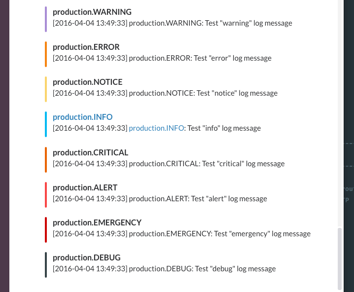

# laravel-cloudwatch-lambda-slack
Use AWS CloudWatch &amp; Lambda to post Laravel Log messages to Slack.




# Setup
## Step 1 - Get Your Laravel Logs into CloudWatch
I've written [an article](https://medium.com/@james_fairhurst/using-aws-cloudwatch-for-laravel-logs-on-forge-27590ee4fe33) which goes through the process of getting your Laravel app logs into CloudWatch. It's *relatively* straight forward however like everything it depends on your experience. Hit me up if you're having trouble.

## Step 2 - Create a Slack Webhook
Create a Slack [Incoming Webhook](https://api.slack.com/incoming-webhooks) which will give you a **Webhook URL** e.g. https://hooks.slack.com/services/xxx/xxx/xxx. Enter the URL without the hostname into **slackPostPath** variable in the **index.js** file e.g.

```
slackPostPath = '/services/xxx/xxx/xxx';
```

## Step 3 - Create a Lambda Function
Create a new Lambda function in the AWS Console and select the **cloudwatch-logs-process-data** blueprint as a starting point, this will ask you to select a Log Group (your Laravel log) and an optional pattern. Name your function and copy & paste the code in **index.js** into the inline code editor.

# Summary
Although there are other ways to get notified of errors e.g. external services ([Bugsnag](https://bugsnag.com/)) or Laravel specific packages ([lern](https://github.com/tylercd100/lern)) depending on your circumstances this could be another option. I've been wanting to delve into & learn the AWS eco-system for some time now and I've been documenting my efforts on Medium to hopefully help others & future me when I come to do things again. I'm also a Nodejs noob so if things can be improved let me know!

# Todo
* Option to exclude log levels e.g. debug & info so only proper errors are reported
* Article to document the Slack & Lambda setup steps
* Another Lambda function that interacts with Trello and creates a todo card